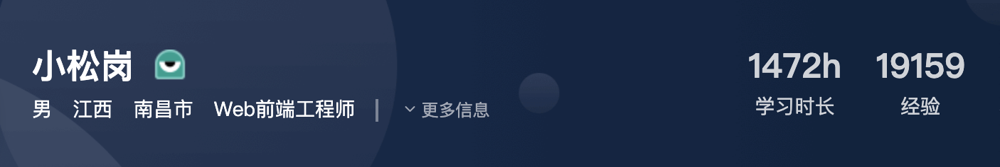
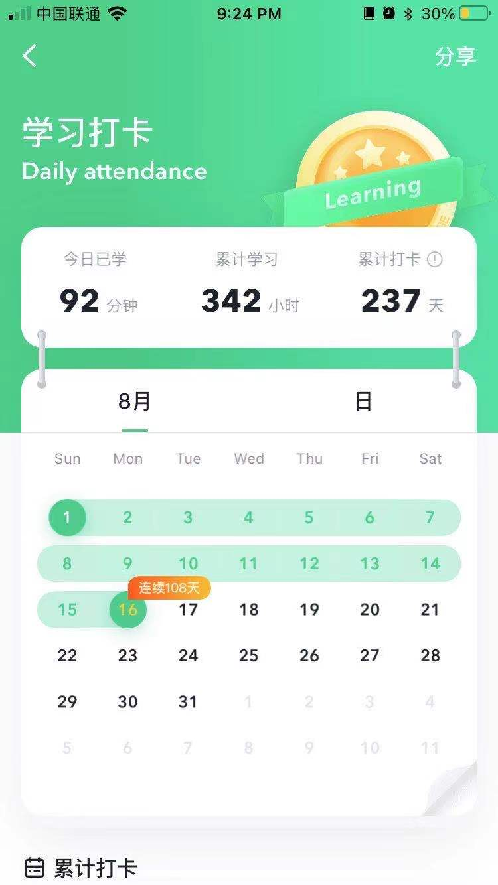

## 前言

16 年中秋节前后一个人带着三千块钱来到杭州做前端开发，至今差不多刚好 5 年的时间，就在前几天收到了网易的入职 offer，乘着离职的空隙时间写个阶段性的总结，也希望这篇总结能够帮助到一路同行的你

## 一个法律事务的大专狗怎么就做起了前端开发？

一切都是兴趣使然，从小就热爱数码产品和计算机的我一直就很想做程序员，我喜欢那种在指尖创造东西感觉，就好像自己是上帝一样，只不过一开始作为门外汉的我完全不知道应该从哪里下手

带我打开新世界大门的是在百度贴吧上找到的一个 WEB 开发 QQ 群，群里的老哥们很热心，我从老哥们日常的闲聊中了解到前后端的开发模式和一些自学开发的途径

我从老哥们口中了解到慕课网这个视频网站，在当时这个网站的视频都是免费的，课程质量也不错，我开始没日没夜的刷视频，通勤路上刷，厕所刷，下班回家躺床上继续刷，当了十几年学渣的我好像开窍了，我找到了比游戏更有意思的乐趣，在慕课网的学习时间也不知不觉的破千了

## 步入正轨

就像闯关打游戏一样，我在完成慕课网的 Java，前端体系视频后，我以为自己神功大成，开始自信的尝试在杭州海投简历

很显然我吃了很多闭门羹，一个法律专业的大专狗没有任何相关工作经验，别人凭什么相信你的工作能力，凭什么培养你，我也一度开始怀疑自己是不是这块料，要不要就此收手打道回府

不过就像所有的故事情节一样，在坚持了一个多月后，最终还是有一家电商创业公司愿意接收我，转正后 7000，大小休，钱不多但是也足够我在杭州立足，随后我搬到了文一西路的骆家庄城中村，这也是日后我使用花名**文西**的原因

后来回头想想公司为什么愿意接收我，也许是因为面试官看到我对技术的热忱，所以决定给我一个机会

## 陷入瓶颈

我在这家公司一边工作一边抽空学习，很快遇到了第一个瓶颈，由于这家公司使用的后端模版引擎 freemarker，前后端工程是完全耦合的，这导致前端能做的事情很有限，react 什么的就更不用想了，只能用 JQ+Avalon 写写页面，有多痛苦写过的都懂

期间我也尝试过去寻找低成本迁移到现代化工程的解决方案，最后我当然没找到，只能看着 QQ 群里用 React 和 Vue 的小伙伴流口水，我也不可能说服 CTO 让一个创业公司的重点项目做一次看起来意义不大的大重构，这不现实
最终还是在 17 年冬季后选择离开第一家公司，去寻求更好的发展

## 新的旅程

有了第一段工作经验，我对前端的道路清晰了很多，我开始有意识的挑选使用前后端分离模式的创业公司，尤其是刚立项不久的，这有利于将我储备的现代化开发知识落地下来

很快我找到了滨江的一家公司，在海创基地内做垂直电商的，CTO 对技术的嗅觉比较敏锐，打算对即将立项的移动端项目使用新的技术栈，也算是一拍即合

团队很小，前后端总共四人，但是我在里可以大展拳脚，作为主程从 0 到 1 落地了整个电商项目，**工程化，组件化，PWA，预渲染**我用当时最激进的技术去实现我认为的最佳实践，并随着我学习的同时，不断对项目进行**小重构**，就像一名园艺师傅一样，不断去修剪自己不满意的地方，并从中获取强迫症般的快感，这绝对是我投入最多心血的一个项目，我也因此收获很多

## 好景不长

我在这家公司工作的很开心，但是在入职快一年后开始出现了资金紧缺的经济状况，CEO 要求我们降薪百分之十共度难关，并承诺在成功融资后会双倍补偿

按照统计，80%的公司都活不过 A 轮，就算 CEO 没骗我他愿意兑现，也得是在成功融资的前提下，这种亏本买卖我肯定不乐意

公司不是做慈善的，我也不是做公益的啊，我在表面答应后开始寻找新东家
为了避免重蹈覆辙上家公司的下场，在求职过程中我开始对公司的财务状况和团队规模有一定要求，我讨厌换工作，因为这会让很多事情重新来过，我希望我至少能正常度过 2，3 年的时间

最终我找到一个开发团队一百多人的 C 轮公司，HR 和我说公司已经实现自我造血能力，账上还有一个亿的流动资金，并且公司已经准备在纳斯达克敲钟，让我不要多心，一度让我以为我去了一家即将成长为独角兽的公司

## 渐入佳境

不管公司如何，开发团队确实很有朝气，前端团队保持在 8 人左右，相比之前 2，3 人的团队，我有新的事情可做，**基础建设**

公司同时拉了好几条业务线，并且业务形态都已经比较成熟了，跟着业务线日常开发那就只能做工具人，通过基础建设去优化开发问题是一个合适的选择，对个人对团队都有益

脚手架，工程能力封装，组件库，自动部署这些都属于基础建设的范围，在技术实现上并不困难都是代码堆砌，麻烦的是如何落地，一个是资源问题，一个是人性问题

### 资源问题

对于大团队来说通常都有自己的基础建设团队，负责一些远离业务的通用能力开发。但对于小团队尤其是创业公司，所有的开发都需要背着业务往前跑，向创业公司索要时间和人力去做基础建设是一件不切实际的事情，因为 80%的创业公司都活不过前三年，跑的快和跑的久哪个对公司重要不言而喻，先活下来再说

在基础建设不能使用公司资源的情况下就要想办法自己消化掉了，总的来说就是去压榨**可自由分配的时间**

1. 尽可能快的结束业务上分配的工作
2. 加班（可选）

#### 编码积累

不同的人的工作效率天差地别，即便是同 P 级工作效率相差 2 倍其实也挺常见，主要还是依靠日常编码的积累，其中有些通用的低成手段可以加快编码效率例如 snippet，这绝对是最低成本提升编码效率的方式，一个不断维护的 user snippet 肯定好过你在各个项目间找代码复制黏贴，更重要的是 snippet 是可以持续维护迭代的，他只是一份 json 文件，不管换了多少公司它都会跟着你，其中有些代码随着不断完善还能单独封装成 npm 包

其实包括这两年新冒出来的**物料**概念，本质上是对 npm 包+snippet 的再抽象，因为 npm 包只擅长抽离通用的基础能力，对一些场景化的编码工作就不适合了，而日常的业务开发绝大部分恰恰都属于场景化的编码工作，这也是 snippet 擅长做的事情

#### 心流状态

至于加班这个问题比较复杂，在大部分情况下加班绝对是高投入低产出的，也就是投入产出比很低，但有一种情况下除外，在心理学中有一个名词叫**心流**，一旦编码活动中进入心流状态，效率和质量会爆炸增长，人在玩游戏时很容易进入心流状态，在其他活动中可遇不可求

在编码活动中进入心流状态我总结了两个前置条件

1. 本身对完成这件任务有**强烈的主观意愿**：如果自身对这个任务很抗拒必定没办法进入心流状态
2. 一个无人打扰的环境：进入心流需要一定的启动时间，而白天总是会有各种同事和会议的打扰

   可以看到往往在公司夜深人静的时候才具备第二个条件，这也是有的工程师说自己晚上效率很高的原因

   总的来说如果你晚上没什么别的计划（打游戏这些不算），你又对手上在做的任务存在因为各种动机支撑的主观意愿，那么加班也是一件划算的事情，而对于此外的其他情况，我还是建议你尽量早点下班，因为在这种情况下工作带来的收益是**边际递减**的，具体可以看下李永乐老师的这篇文章，[“996 工作制”是奋斗还是剥削？](https://www.bilibili.com/read/cv7579529)

扯远了，总之通过压榨可支配时间，我在业务任务之余做了很多基础建设工作，最后甚至做了 no-code [H5 可视化构建工具](https://wenxi.tech/principle-analysis-of-H5-visual-construction-tool/)

### 人性问题

我发现好些团队都有这些问题，尤其是具备了一定规模的团队，内部的包和工具写了一堆没人愿意用，本质上是开发这些包的工程师只关注技术本身而忽略了技术之外的一些人性问题导致的

具体的表现就是缺乏文档，缺乏各个场景的代码示例，缺乏 demo，没有类型检查 IDE 不友好，其他工程师要消费这些组件需要巨大的**心智成本**，狗都不用

更离谱的是一些重复造轮子的问题，明明社区已经有更高质量的解决方案，非得自己再来一遍，如果真的需要造轮子，至少应该证明你的轮子比社区的更适合你们的业务场景，同时命名和调用方式尽量**和社区方案保持一致**

不过当时我也没意识到这个问题，这块做的也很不好

## 历史重演

我在第三家公司工作了一年后你猜怎么着，这家公司也出现经济问题了，说好的纳斯达克敲钟呢

不过在经历了一个创业公司从意气风发-\>衰弱-\>竭泽而渔从用户身上榨取最后价值-\>死亡的一系列过程还挺有意思的，也让我明白**资本既是孵化剂也是慢性毒药**的道理

有了之前的经验，我没有理会公司画的大饼，很快提了离职（后来的事实证明我是对的），但是面了两个礼拜却没找到满意的工作，我开始意识到自己的一些问题，我跑的太快了，基础不牢靠

在此之前我获取知识的来源主要依靠在线视频，社区文章和一些工具书，但是作为法律专业的我从来**没有系统学习过计算机课程**，在以前我觉得不重要，现在看来却错的离谱

当意识到这个问题后我有意识的去面一些业务稳定的不加班部门，我希望找份闲差能让我有时间做一次查漏补缺

## 查漏补缺

后来我找到了第 4 家公司，这家企业不需要融资，经济和业务都十分稳定，5 年 4 家公司，这家公司让我工作了最后 2 年时间。他是我工作时间最长也是业务之外搞事最少的公司

我抽空考了**工科学位**和**软件设计师**的证，在这个过程中对计算机基础和软件设计相关知识做查漏补缺，英语水平也从几乎为零提升到不借助翻译正常阅读框架文档，我甚至通过[Crash Course](https://thecrashcourse.com/)
学习了一些认知心理学和脑科学知识

英语真的很重要，很多大公司会把能够无障碍阅读英语文档的要求写在 JD 里，另一方英文社区的技术资料质量普遍比中文社区高几个等级，它应该作为一名优秀工程师的基本技能

我自己在用的 APP 是开言英语，每天差不多 90 分钟，虽然还是哑巴英语，但是之前语法一窍不通的我现在能正常读点框架文档了，这对我最近学习 Rust 和 IPFS 很有帮助，因为它们的中文资料非常少

这个阶段我也开始重视笔记的重要性，因为知识是有错觉的，你可能认为你掌握了一个知识点，但是真被问到了往往会支支吾吾含糊其词，不信的话我们现在可以做一个实验，请在电子笔记上写下闭包和词法作用域的关系，感兴趣的可以看下[《知识的错觉》](https://book.douban.com/subject/27178073/)

解决知识错觉最好的办法就是做笔记（摘抄原文不算笔记），在写笔记的过程中会发现自己对知识理解的薄弱点，去优化它，完善它并最终发表，这恰好就是[费曼学习法](https://wiki.mbalib.com/wiki/%E8%B4%B9%E6%9B%BC%E5%AD%A6%E4%B9%A0%E6%B3%95)的践行方式，包括我写订阅号的目的也是如此

记笔记有多重要从市场角度也能看出来，去年一款笔记软件[Roam Research](https://roamresearch.com/) 以 2 亿美元的估值筹集了 900 万美元融资，用户订阅费用每月 15 美刀

又扯远了，但是如果你对笔记软件感兴趣同时口袋又比较紧可以使用开源的[Logseq](https://github.com/logseq/logseq)

## 五年收尾

就像前言说的我打算换工作了，这次投的很少，给了面试机会的四家公司最终都发了 offer，网易，有赞，微医，丁香园，因为一些原因最终我没有选择 base 最多的有赞而是选择了网易

最后我也总结了一些建议，希望对你有用

### 如果你还是学生

1. 学历还是最有效的杠杆，现在 985 院校的应届毕业生都是 40W+了，而我用了五年，如果你现在学历很差马上去自考，欠下的债进入社会后需要十倍百倍的偿还
2. 毕业后去北京上海，相同能力在北京上海比杭州这类城市最大有 30%的浮动空间，你不要想着生活成本高，行业普遍情况是 HR 喜欢卡涨幅上限，你现在 base 越高日后的议价空间越大
3. 在没有很好的社招 offer（大厂）情况下先从创业公司入手，虽然走起来很困难但其实也是一个机会，总好过去一个已经成熟的公司去拧螺丝钉

### 其他建议

1. **不要把自己局限在前端**，一定要有脱离公司平台的能力，公司希望你成为整个分工协作网络的一个节点，但是一旦分工协作网络发生变化，如果你不具备单兵作战能力被甩出去的一定是你，要知道前端开发工程师这个岗位至今才 16 年历史
2. **差异化竞争**，打破技术次元壁，在我有限的认知里这可能是技术人走向百万年薪的唯一途径，我认识的一些真大佬他们都在技术之外同样有些出彩技能，如法律合规，团队管理，产品思维
3. **不要陷入框架陷阱**，我自己曾经也有这样的问题，每当发现个新框架都要去把玩下，前端界造轮子有多快大家都知道，后果就是我在上面浪费了大量的时间，其中有些现在都淘汰了，所以我的建议是每当新技术出现时先让子弹飞一会（尤其是阿里的），如果实在感兴趣把重点放在框架的核心实现和设计思想上，而不是如何 API 调用

以上这些建议同样也是写给我的

## END

这篇总结为了方便我日后回顾废话很多，也希望对文章前的你有所帮助，下一个五年见 👋
