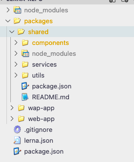
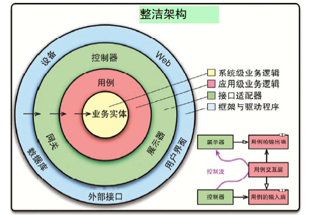

## 前言

基础代码的复用往往比较简单，但是业务代码的复用通常是困难的，如果没有特殊的手段去治理项目会逐渐发展为难以维护的巨石应用，按照维基百科记载，代码的[复用形式](https://www.wikiwand.com/zh-hans/%E4%BB%A3%E7%A0%81%E5%A4%8D%E7%94%A8)主要有三种，**程序库，应用框架，设计模式**，本文就从这三个维度出发，分享下我对业务代码复用的思考

## 程序库

前端业务代码在程序库的体现主要是通过**业务组件**，稍微大点的团队都有自己的业务组件库，但是我去过的很多团队都有落地难的问题，其中有些是技术层面的，但是更多的是出现在跨职责协作上，其中，我认为影响最大的是 UI 设计师和前端开发之间的协作关系

### UI 组件资产

UI 设计师作为前端的直接上游，生产前端工程师所需的设计资源，如果生产的设计资源本身就是不规范的，必然会极大影响前端团队组件化的发展

UI 设计师作为设计人员，和工程师的思维方式不同，对组件设计规范的意识并不强烈，大部分设计人员对规范的定义仅仅在主题色和主观意识强烈的 **风格** 上，UI 设计师的最终产出由少部分 **视觉要素约定** +设计师个人 **主观设计倾向** 决定，也就是说，设计师的心情好坏和人员更替会直接影响每次产出设计稿的呈现，这对设计师来说很正常，但对前端工程师来说是致命的

基于此，我们需要在工具上对 UI 设计师的产出加以约束，使其在前端工程师可接受的范围内自由发挥，例如 figma，figma 的 [component](https://help.figma.com/hc/en-us/articles/360038662654-Guide-to-Components-in-Figma) 概念与前端组件化概念高度吻合，我们可以要求设计稿中可复用的独立单元必须是一个 figma component，从而倒逼设计师建立业务的组件资产，进而确保组件设计的一致性

### 组件代码设计

按照软件设计原则，`找到程序中的变化内容并将其与不变的内容区分开`，而在前端，按照代码改动频率依次排列，视图代码>视图逻辑>业务逻辑，相比业务逻辑，UI 代码属于高频变动的部分，尤其是是由 html+css 组成的视图代码

例如电商的商品卡片，不同节日下的商品卡片很可能有不同的 UI 样式，但是他们的业务逻辑是一样的，他们使用同样的业务数据和业务行为

在这种情况下大部分开发会选择两条路，要么为每个节日商品卡片单独封装一个组件，要么封装一个包含所有节日样式的巨石组件，然后由外部的一个 prop 参数控制组件的渲染

前者会导致代码的大量冗余，后者违背了单一职责的设计原则，组件内部根据外部传入的节日类型写了一堆 if else，时间久了没人看得懂一堆 if else 里写的是什么

为了减少代码冗余和提升可维护性，我们可以按照职责将组件划为四部分

- 业务上下文组件
- 交互上下文组件
- 无状态视图组件
- 入口组件

可以看到和 Flux 架构很像，但是又有些区别，更像是对 Flux 架构的补充完善

- **多了一层交互状态组件**，在 Flux 架构里只是简单区分了无状态组件和有状态组件，但是对 UI 的状态管理很模糊，究竟是由视图组件自己生产自己消费，还是由状态组件统一管理。不过 Flux 架构都是五年前的东西了，当时对组件的状态管理还处于探索阶段，也没有 hooks 这种能够最小化抽取状态和逻辑的利器，对代码的粒度按照职责做了进一步的细分，自然就有了更多复用的可能
- **使用 context + hook 代替 props 传参**，这个其实很好理解，在父组的 render 函数里声明子组件并对子组件传参，从而达到控制子组件渲染的目的，这在耦合定义里叫**控制耦合**，而使用 context 可以做到无需在父组件内声明子组件也依旧可以传递数据，这种基于消费数据结构而进行耦合的方式叫**数据耦合**，在对各种耦合的定义中，**数据耦合**就是要比**标记耦合**的耦合度更低，耦合度低复用率也就上去了
- **减少全局依赖，把全局依赖下沉到某种上下文里**，之前做过几次老代码到新项目的迁移，迁移过去的组件有大量直接依赖全局环境的代码，request，localstorage，甚至是挂在 window 下的全局变量，为了不影响新项目的运行，迁移过去的老代码做了大量修改，如果一开始就把这些全局依赖封装在 context 里，平移过去的代码几乎不需要修改，或者只是修改 context 这一小块就够了

看下代码结构

```js
//业务上下文
const GoodItemBusiness = () => {
  const [data, setData] = useState({})

  return (
    <BusinessContext.Provider value={{ data }}>
      {children}
    </BusinessContext.Provider>
  )
}
//交互上下文
const GoodItemInteraction = () => {
  const [UIState, setUIState] = useState(false)
  const openPreview = () => {
    // do somethings
  }
  return (
    <InteractionContext.Provider value={{ UIState, openPreview }}>
      {children}
    </InteractionContext.Provider>
  )
}
//视图组件：​
const GoodItemView = () => {
  const { data } = useContext(BusinessContext)
  const { UIState, openPreview } = useContext(InteractionContext)

  // 在这里连接业务与交互
  return (
    <div>
      <p>{data.title}</p>
      <button onClick={openPreview}>预览</button>
    </div>
  )
}
//入口组件：​
const GoodItem = () => {
  return (
    <GoodItemBusiness>
      <GoodItemInteraction>
        <GoodItemView />
      </GoodItemInteraction>
    </GoodItemBusiness>
  )
}
```

基于这种分层思想的代码结构，当我们新增一个节日类型视图时，就可以继续组合之前的业务上下文组件和交互上下文组件，形成新的节日商品组件

更详细的内容可以看这篇文章，[业务中的前端组件化体系](https://zhuanlan.zhihu.com/p/383129585)

## 应用框架

一条业务线往往会存在多个项目，不同项目之间通用业务代码的复用一直是个问题，在若干个项目上往往存在着多次复制黏贴的代码，经过项目的多次迭代，他们可能还会在各自的项目上衍生出不同的版本，长此以往维护成本会让开发人员痛苦不堪，我们当然知道抽离到 npm 私库是最佳实践，但是抽离模块的繁琐过程很大程度上提高了业务线上开发人员的心智成本，从而降低了将代码抽离到 npm 的意愿，在这种情况下，Monorepo 也许是更好的解决方案

lerna 提供了一个简易的 Monorepo 方案，利用 lerna 软链接项目作为依赖的特性，使得项目间的代码共享变得更加容易



上面我们用 lerna 管理了三个项目，其中 shared 属于其他两个项目的共享代码，wap-app 和 web-app 可以通过依赖的方式直接消费 shared 项目中的组件，工具函数和业务服务，极大优化我们的工作流程

```js
import "./App.css"
import Header from "shared/components/Header"

function App() {
  return <Header></Header>
}

export default App
```

## 设计模式

很多时候我们提到代码复用第一时间想到的组件，但是组件有组件的局限性，它是和 UI 框架 **强耦合** 的，而有一些场景需要需要实现 ==跨平台跨框架的代码复用== ，例如一个产品它既有 PC 网页，也有 RN 开发的 App，还有小程序

他们存在完全迥异的视图层或者框架体系，与之强耦合的组件没办法实现复用，但它们背后的业务逻辑都是一样的，所以为了复用我们的业务逻辑，需要实现业务逻辑的 ==框架无关，环境无关==

《架构整洁之道》中提出的**整洁架构**就是解决这个问题的，腾讯文档团队也有对整洁架构的相关实践 👉🏻[让 JS 摆脱框架的束缚](https://mp.weixin.qq.com/s/n65x3duoeQAtQU_fH_dJDw)


这种架构使得，框架和一切外部相关的实现细节被隔离在**框架与驱动层**，**业务逻辑层**只负责业务本身，与外部的联系由**接口适配器层**控制，假设我们需要从 Vue 迁移到 React，或者从 Vue2 升级到 Vue3，我们只需要变动接口适配器层和框架与驱动层，业务逻辑层可以继续复用

实现方式可以看到一些设计原则的影子

- LSP：里氏替换原则。多态思想，依赖于一种接口，则实现该接口的具体类之间就都具有了可替换性。
- DIP：依赖反转原则。面向接口编程，多使用稳定的抽象接口，少依赖多变的具体实现。

优缺点都很明显，业务逻辑只和 JS 语言强相关，不挑平台和框架，易于移植，框架升级的时候即使有很大的 breaking-change，也完全 hold 住

缺点是确实是带来了工程的复杂度和代码量的提升，需要自行做 trade-off

## 总结

本文按照程序库，应用框架，设计模式三个维度阐述我对代码复用的思考，它们可以相辅相成并不冲突，之后有空会写个稍微完整的 demo，如果觉得文章写的不错可以**关注**、**点赞** 🥳
