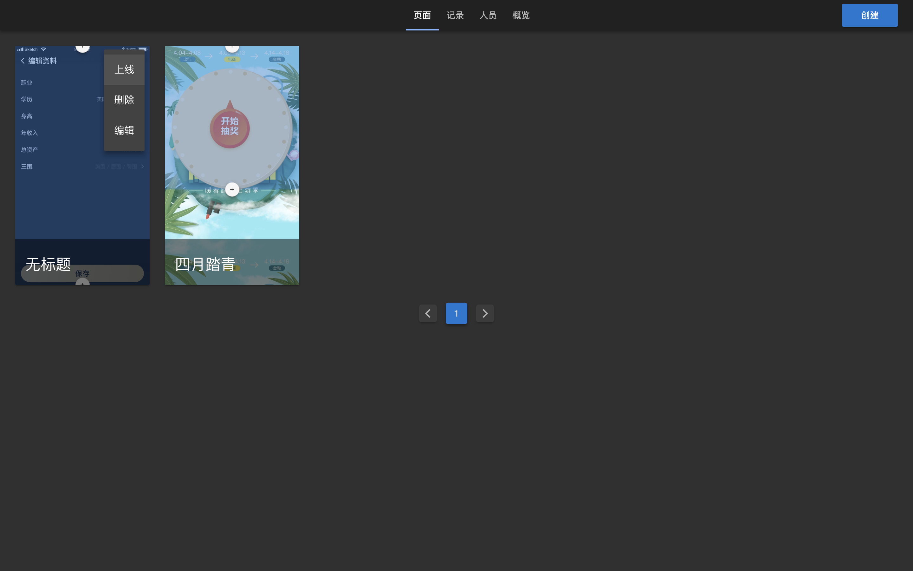
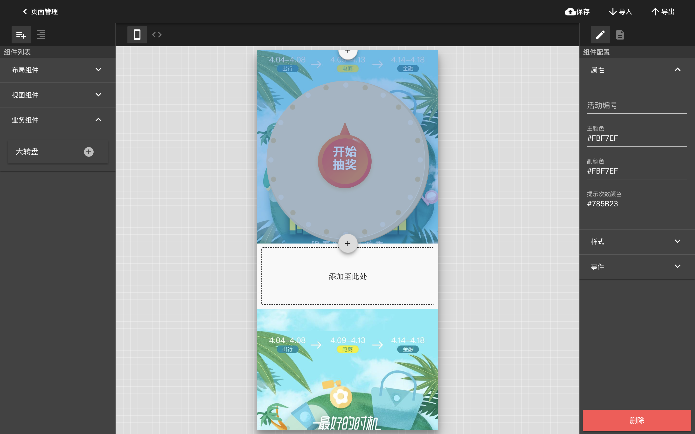
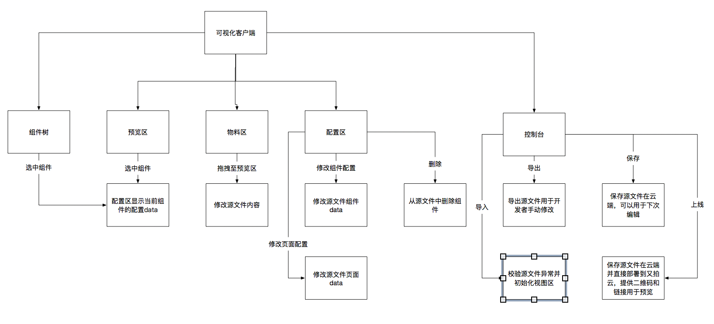
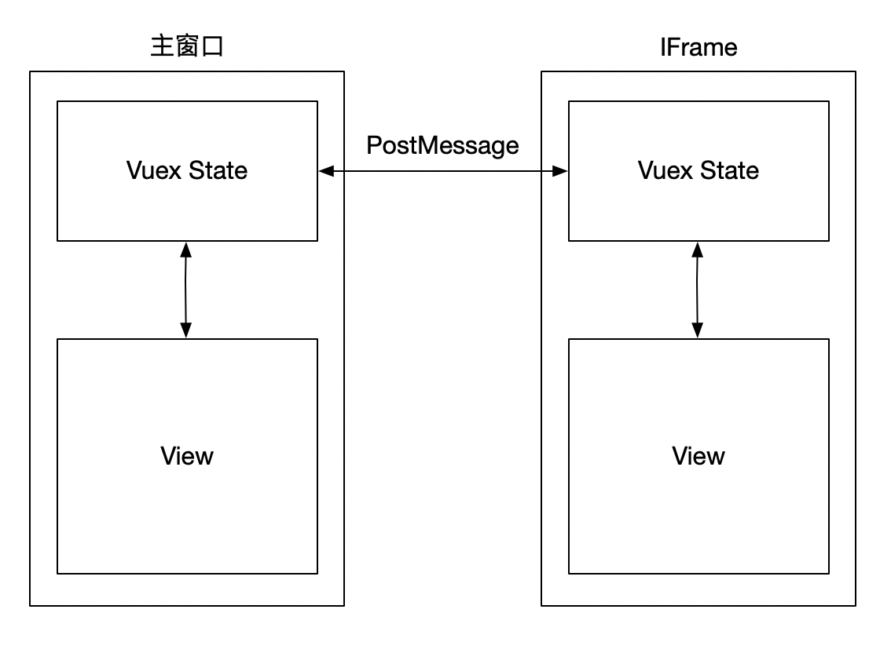

## 前言

> 总共近 8 万行代码实现 H5 可视化构建工具，18 年开始陆续做了大半年，现已投入到业务中使用，前端已开源，后端涉及部分业务就不开源了，主要讲讲实现思路，算是该项目的回顾总结，将核心难点、重点做拆分解析，拆分成系列不定期更新

### 成品图






### 技术栈

- 前端 Vue-CLI3 全家桶、Electron、GraphQL、Typescript、Stylus、Vuetify
- 后端 Koa2、GraphQL、Nuxt、MongoDB

### 为什么需要 H5 可视化构建工具

互联网行业运营需求频繁，而且需求周期短，往往只有 1、2 天开发时间，放在项目里既拖慢整体编译效率，同时又没有任何意义，基本上都是当月作废，同时对开发者本身没有任何提升，重复劳动，我们要做的就是通过工程的方式解放生产力，由运营同学自己完成活动页上线，而不再需要开发资源

### 确定产品原型

- 提供可视化编辑的控制台生成 Vue SFC 源码
- 可以对已生成的页面进行管理（编辑，上下线）
- 控制台提供自上而下的单列布局适配移动端 H5，简化操作逻辑
- 添加的组件可编辑属性、样式、事件回调
- 易于扩展的组件注册机制

> 这是我早期画的原型图，画的不太好，看看就好



> 接下来，我们对第一个会遇到的难点进行解析

### 如何尽可能模拟移动端真实环境

方案一：通过子组件实现模拟

- 优点：实现简单，并且作为子组件，状态和行为完全受父组件控制
- 缺点：由于处于同一个 window 上下文，子组件的内容会被全局样式污染，难以保证与实机一致，同时 UA 和 rem 等相对尺寸会失效

方案二：
通过 iframe 创建独立的 window 上下文来模拟

- 优点：iframe 包含完整的 HTML 代码，拥有独立的上下文，可以尽可能的模拟移动端环境
- 缺点：数据不共享，只能通过 PostMessage 机制进行通信

---

对于方案一，没有独立的 window 上下文，缺陷是不可逆的，而方案二除了通信困难，其他近乎完美，数据不共享的问题我们可以通过实现 StateSync 机制来实现，我们这里选择方案二，那如何实现 StateSync 呢？

这里只需要三个步骤

1. 首先我们把页面编辑所需要的所有数据都提升到 Vuex 做全局存储
2. 监听 store 中所有的数据变化

实现监听 store 的伪代码:

```js
const store = new Vuex.Store({
  state: {
    // 页面数据
    // ...
  },
  mutations: {
    //...
  },
})

// !由于mutation是Vuex中最小的提交粒度，所以只需要监听mutation就可以监听所有的数据变动
store.subscribe((mutation, state) => {
  // 数据发送
  // do someting ...
})
```

> 重点来了 3. 当触发 mutation 时将整个 Vuex Module State 通过 PostMessage 发送给对方（主窗口/iframe）

数据流走向图：



```js
// 主窗口代码

// 监听来自iFrame的数据推送
window.addEventListener("message", event => {
  // 将iFrame推送的数据做同步操作
  store.dispatch(STATE_SYNC, event.data)
})

store.subscribe((mutation, state) => {
  // 这里我们要避免出现死循环，忽略掉来自 THREAD_STATE_SYNC 的提交
  if (mutation.type.includes(THREAD_STATE_SYNC)) return

  // 主窗口数据变动时同步至iframe
  iframe.contentWindow.postMessage(state)
})
```

```js
// iframe 代码

window.addEventListener("message", event => {
  // 将iFrame推送的数据做同步操作
  store.dispatch(STATE_SYNC, event.data)
})

store.subscribe((mutation, state) => {
  if (mutation.type.includes(THREAD_STATE_SYNC)) return

  // 副线程发送
  window.parent.postMessage(state)
})
```

至此，我们完成了主窗口到 iframe 的数据自动同步，保证了数据的一致性同时，尽可能的模拟了移动端的真实特性，为我们的 H5 可视化编辑器打好基础，下一期我会开始讲如何实现 UI 组件库和可视化编辑器解偶，实现无痛迭代 UI 组件库和最大化复用 UI 组件

#### 下一期

深入解析 H5 可视化构建工具原理（二） 如何实现外部组件注册机制

### 最后

第一次正儿八经的写文章，可能想表达的东西没写清楚，有问题大家可以在评论区留言，顺便最近在找工作，有好的就业机会请联系我的微信：wxdreams,十分感激
