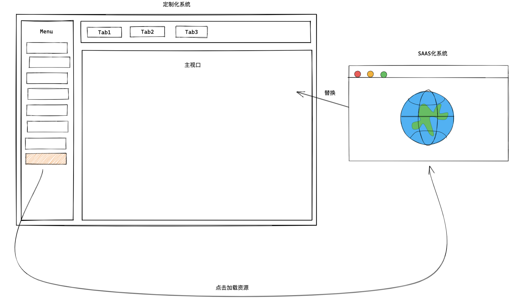

如今微前端大热，你去面试，面试官开口就问微前端原理，如何落地微前端，微前端解决了什么问题，灵魂三连，吓得面试者赶忙回去看下微前端到底是个啥，希望这篇文章能够帮你认清什么是微前端，并酌情考虑要不要使用 qiankun 这类解决方案，先说明，我真的不是在唱反调

### 一切的起因要从 20 年的那个夜晚开始

20 年初我在知乎上看到 qiankun 的作者 kuitos 发表了一篇文章 [可能是你见过最完善的微前端解决方案](https://zhuanlan.zhihu.com/p/78362028) ，看到标题的刹那我不由得虎躯一震，赶忙打开文章看看，一看作者是蚂蚁的大佬，不由得再次精神一振，仔细拜读两遍文章，自我感觉收获颇丰，就是不知道好不好落地啊，当看到文章最后作者的对 qiankun 的总结，顿时觉得喜出望外

> 取名 qiankun，意为统一。我们希望通过 qiankun 这种技术手段，让你能很方便的将一个巨石应用改造成一个基于微前端架构的系统，并且不再需要去关注各种过程中的技术细节，做到真正的开箱即用和生产可用。
> 对于 umi 用户我们也提供了配套的 qiankun 插件 @umijs/plugin-qiankun ，以便于 umi 应用能几乎零成本的接入 qiankun。

我司用的也恰好是 umi 的技术栈，我马上打起了落地 qiankun 的主意，看到蚂蚁大佬这么笃定，想来周末自己折腾两天就能落地了，说不定还有空打几盘游戏，想想还挺高兴，就在打算自己周末折腾下的时候，有人来送枕头了，来新需求了！！！


先说下项目的情况，我手头有一个大客户的定制化项目，还有一个标准的 SAAS 化产品，CTO 希望这个大客户的项目能够复用标准化产品的部分模块，而不是重新开发，我很快想到了当时正火的微前端，之前一直苦于没有合适的项目让我落地微前端，现在天时地利人和都有了岂有不上的道理


我啪的一下，很快啊，马上就冲进了 CTO 的办公室里，说了一堆微前端，吧啦吧啦什么的让人听不懂的黑话，CTO 果然被我唬住了，答应给我个机会施展下拳脚，不过我多了个心眼要了一个礼拜的时间，万一时间不够还有缓和的余地，时间够的话还可以摸 🐟，想想还有点小激动


说干就干，我简单理了下思路，打算把定制化项目改造成基座项目，SAAS 项目改造成子项目，当点击侧边栏的一个模块菜单时，把主操作区切换到子项目



so easy，开整

1.  主项目和子项目添加 `@umijs/plugin-qiankun` 依赖
2.  子项目 app.js 导出生命周期
3.  主项目添加注册子项目的注册信息

搞定~，整活期间略有坎坷，但是问题不大，子应用已经可以在主应用中加载现实了，而且我只花了一天的时间，还有 4 天的时间可以摸鱼，太棒了 awesome 🥳

随便点点简单测一下

### what？我的主应用样式怎么全崩掉了，不是说有样式隔离吗？

一番排查发现是因为主项目用的 antd2，子项目用的 antd4，样式冲突了，qiankun 的 css 隔离机制 `Dynamic Stylesheet` 很简单，就是在进入子应用的时候加载 css，离开子应用的时候卸载 css，这可以解决子应用与子应用的冲突，但是不能解决子应用和主应用的冲突


不过这难不倒我，antd 的样式使用 less 编写，并且所有的 class 都被包裹在@ant-prefix 这个 less 变量下，只需要稍加修改下 webpack 就可以覆盖这个变量，达到给 antd 添加 namespace 的效果

```js
{
  loader: 'less-loader',
  options: {
    modifyVars: {
      '@ant-prefix': 'yourPrefix',
    },
    javascriptEnabled: true,
  },
}
```

点开页面验证下，我去，还有问题，原来@ant-prefix 只包裹了组件样式，但是像 `reset.css` 这些全局样式的污染是解决不了的，只能发现一个样式冲突改一个，而且不光是依赖包的全局样式存在冲突，项目当中也有大量全局样式的定义，有的用来做 utils，有的用来覆盖第三方组件的样式，这些冲突的全局样式散落在项目中各个地方，怎么办，只能硬着头皮手动改，好在时间还算充裕，改了一天总算是改完了，松了一口气后再验证下


### wc！ `router.push` 怎么不起作用了

排查了下，主要有两个问题

1.  作为子应用运行和独立运行有区别，他们的路由路径不一致，举个例子

    - 独立运行的跳转路径 `router.push('/list/item')`
    - 作为子应用的跳转路径 `router.push('/sub-app/list/item')`

    问题不大，我可以判断当前子应用是否在主应用环境下，给他加个 base

2.  但是这引出来第二个问题，子应用没办法跳主应用的页面

    在第一步我们给子应用添加了一个 base，跳主应用时 `router.push('/user/info')` 会自动转换成 `router.push('/sub-app/user/info')` 导致 404，思来想去都没想道什么好办法，最终在全局绑了一个事件总线，主子应用通过事件总线通信，让子应用调主应用的 `router.push` 去跳转，总算解决了路由跳转的问题，不过这又带出来了一个新问题，后面再说，目前看来页面至少能够正常工作，找个复杂的页面检查下

### 我去，这页面怎么这么卡

表单输入有肉眼可见的延迟，不是说在蚂蚁内部服务了超过 200+ 线上应用吗，没道理啊


先去 issues 上随便搜一下，原来不光我碰到这个问题，是一堆人，堆人，人...

1.  [接入 qiankun 框架后,卡顿现象凸显的问题](https://github.com/umijs/qiankun/issues/1320)
2.  [使用 loadMicroApp 手动调用子应用后访问 indexDB 存在性能问题](https://github.com/umijs/qiankun/issues/1432)
3.  [使用 loadMicroApp 手动加载多个应用时存在性能问题，求优化](https://github.com/umijs/qiankun/issues/1380)
4.  [主应用加载一个 3D 的微应用时，3D 微应用的性能会降低到原来的五六分之一](https://github.com/umijs/qiankun/issues/1340)
5.  [微应用嵌入框架后，导致内存占用增加，出现卡顿，独立运行没有问题](https://github.com/umijs/qiankun/issues/1368)

总结下观察到的原因，性能问题主要来自 qiankun 的 JS 沙箱方案，在面对 dom 操作的场景时，性能的损耗相差十倍以上，一些复杂页面 fps 直接降低到个位数，关掉 sandbox 可以显著提升性能

关掉 sandbox 可以显著提升性能。。。

居然提供关闭 sandbox 如此贴心的选项，是已经预知到 sandbox 存在问题留了条后路？可以说是服务很周到了，谢谢啊


还有很多问题就不一一列举了，有的问题一次性解决了，有的问题解决了但是在在之后的迭代中反复出现，有的问题压根解决不了只能通过约定规避，所有的这些问题可以被归类到三个问题里

1.  代码外逃沙箱控制导致的全局冲突问题
2.  代码在沙箱内运行错误的问题（主要是 BOM，DOM 的 API）
3.  代码在沙箱中运行导致的性能问题

那很多小伙伴要说了，那 qiankun 就一无是处了吗，iframe 就是更好的解决方案吗，这里引用尤雨溪的一句话

> 做技术哪有什么两全之策，都是取舍和平衡

你不应该盲目的选择 qiankun 或者是 iframe，而是应该选择最适合的方案，我这里简单列举了下我认为不适合 qiankun 的场景

1.  跨团队对一个大的项目做拆分，多团队并行开发的情况，这种情况不适合，想象一下，有个因为代码外逃沙箱控制导致的全局冲突问题，开发的时候没问题，放一起提测出问题了，你不得不和别的部门撕逼谁去改这个 bug

    更严重的是，测试环境没测出问题，你这个版本的迭代无论是在测试环境还是本地都是好的，但是影响到了不在这个版本范围的其他功能，这个功能还是别的团队在做的，然后你们发上线了，线上出问题了，惊不惊喜，意不意外，你猜会不会有人砍你

    

2.  过于老旧的项目，因为很难做到完全零成本的迁移，适配的过程需要修改很多问题，如果这个老项目属于典型的代码 💩 山，存在大量不规范编码问题，你可能会改的很痛苦，甚至完全改不动

3.  技术栈迥异的项目，比如主项目是 React，子项目是 Vue，他们使用不同的 UI 库，一方面完全没办法做公共依赖抽取，另一方面也很更容易出现很明显的样式污染

列举了不适合的场景，我总结了几个要使用微前端方案的建议

1.  拆解后的项目由一个团队维护而不是跨团队协作，因为项目迭代的生命周期对团队成员透明，也更可控，不会出现跨团队撕 X 的问题（对于稳定性要求不高的项目可以无视这条）

2.  主项目和子项目使用相同技术栈，使用相同的技术栈可以实现主项目抽离公共依赖和全局样式，一方面是可以提升加载速度，减少内存消耗，更重要的是，这是唯一可以尽可能减少全局样式污染的方式

3.  主项目这一层需要足够的薄，尽可能做到只包含登录，鉴权，布局这些基础逻辑，和业务相关的都放到子项目中，并且保证同一时间只有一个子项目，最大可能避免当代码外逃沙箱时的影响范围

4.  要拆解的项目最好是刚立项不久，或者项目还未创建，一方面新项目具备兼容微前端的工程能力，另一方面新项目使用微前端方案的成本最低，不需要改太多代码

如果你的项目不满足以上条件，我建议你使用 iframe 的方案，iframe 除了**没办法遮挡主项目视图**这个问题外，其他的问题都是可以通过简单的封装解决的

Iframe 相比微前端最重要的优势是一劳永逸，十分稳定，iframe 提供线程级别的隔离能力，每个子应用使用单独的渲染线程和 JS 执行线程，稳得一匹的同时还没性能问题

### 故事的结尾

> 我落地了微前端方案，为个性化项目带来了代码拆分和业务模块复用的能力，极大提升了前端开发的效率，加强了项目的鲁棒性 ——— 我在 KPI 中如是说道


### 最后总结

年轻人不要听风就是雨，naive，微前端不是银弹，不要老想着用些新词去修饰 KPI，应该考虑到真实的 ROI，寻找真正适合项目的技术实现
