## 富文本编辑器发展背景

### 传统编辑器

- 在计算机中，最早的编辑器是各个系统的终端，他们没有 GUI，用户可以在终端中输入文本和撤销，重做等基础功能
- 随着用户图形界面的兴起，用户对图片，排版，表格，图表有了更多的需求，也就是在这些需求下富文本编辑器诞生了，其中 Word，WPS，Pages 都是代表产品
- 其中第一个 GUI 版本的 Office1.0 于 1990 年发布，至今已经有了 31 年的历史
  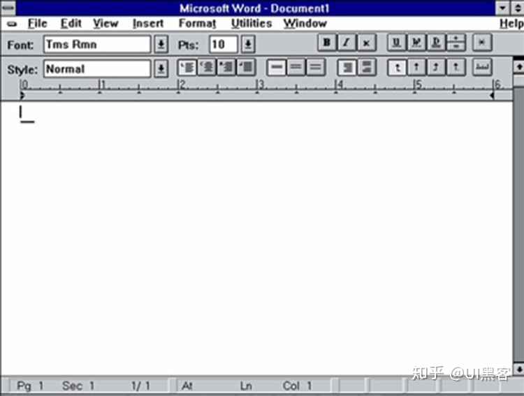

### 现代编辑器

- 传统的富文本编辑器迭代至今，功能已经异常强大，但是进入互联网时代后它也同样暴露了很多设计之初那个年代考虑不到的问题
  - 不支持多人协同，分享
  - 不支持丰富的互联网数据格式，例如音视频，地图等等
  - 不支持自动同步，多端使用
- 在新的需求支持下，新一代基于 Web 的富文本编辑器诞生了，如语雀，有道云笔记，Notion，RoamRearch 等等，他们使用 Web 技术支持多端同步使用，可以很方便的与他人进行分享和协同，并支持大量的互联网数据格式
  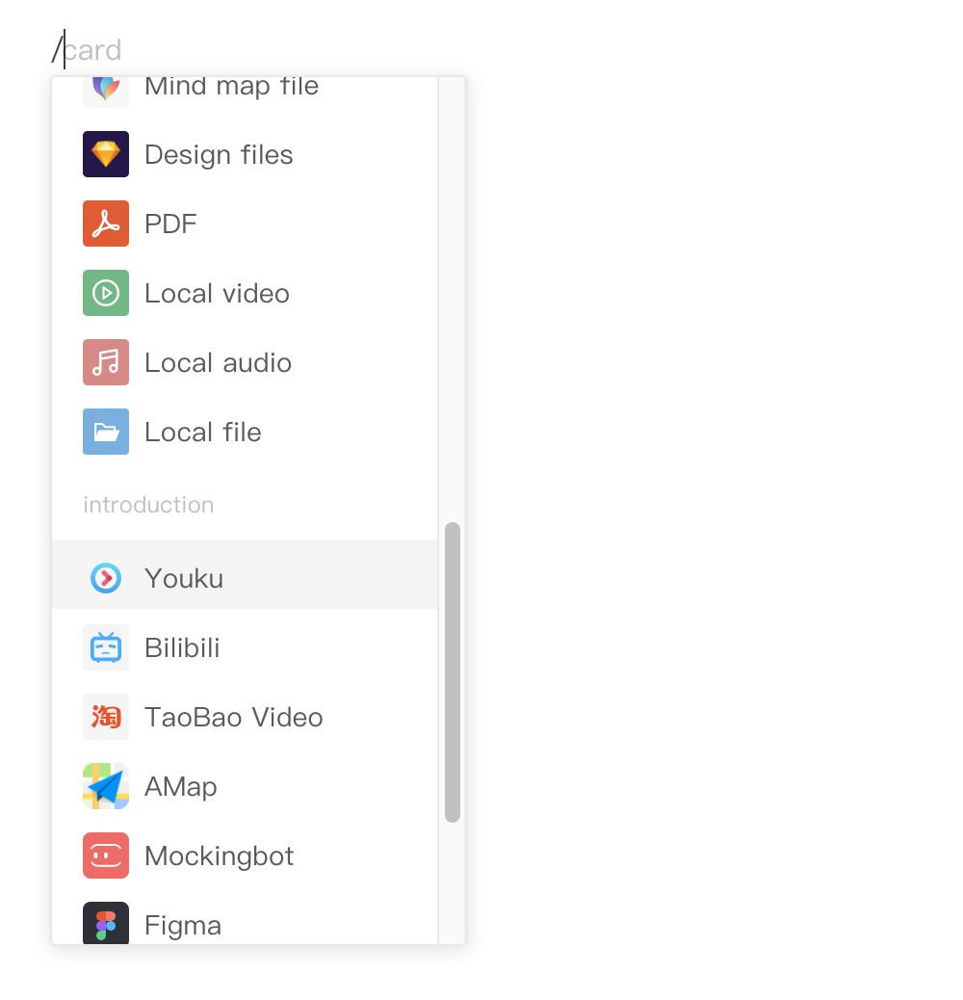

## 编辑器的技术

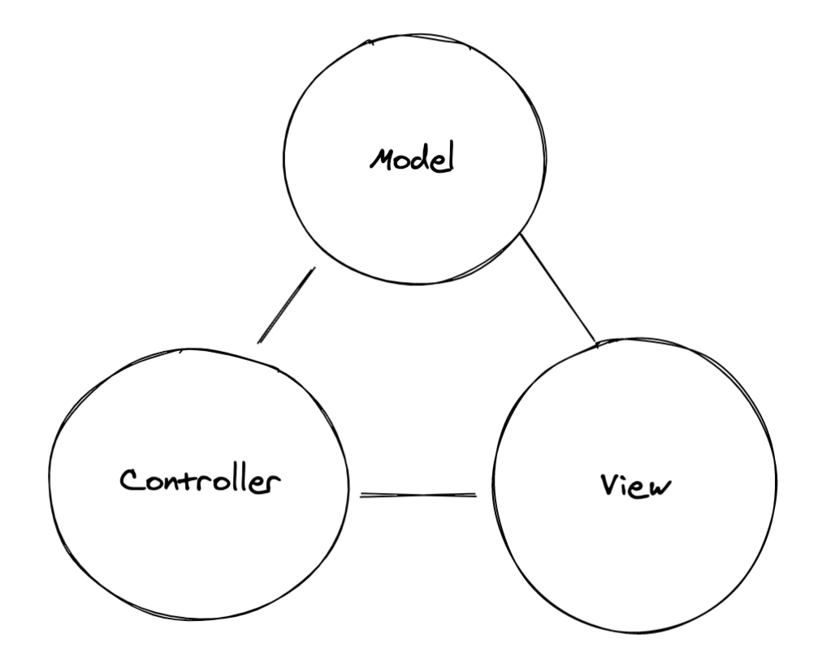

### Model

- 模型分存储模型和视图模型，视图模型用来渲染页面，存储模型用来持久化存储
- 存储模型和视图模型之间可以互相转换，所以一般来说差别不大，在 **设计存储模型时还要考虑到体积，带宽，序列化效率，正确性校验** 等等
  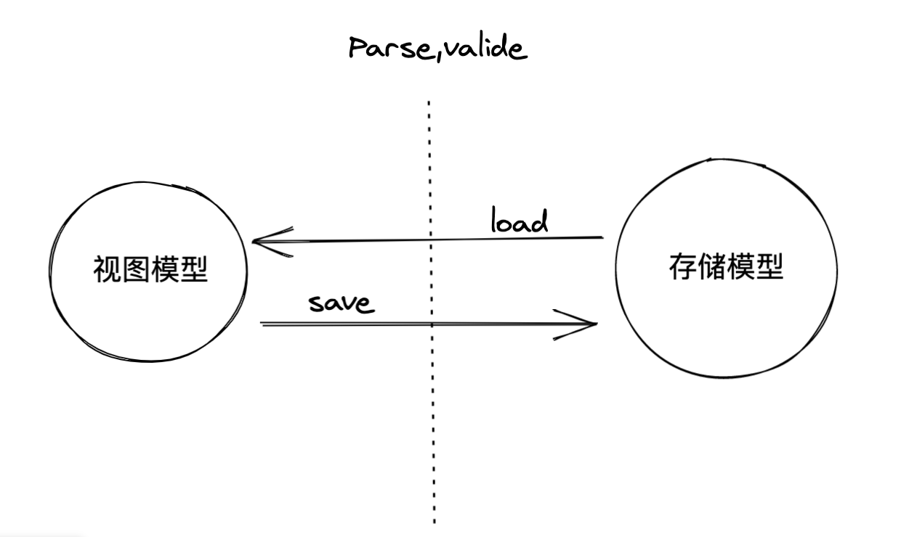
- 举个 🌰
  - 以 Typora 为例，存储模型使用 markdown 文件，当加载文件时读取 md 内容，通过 parser 解析为 JSON 格式的视图模型

### EditorView

- 使用各种手段将视图模型渲染为可编辑的视图，也就是用户所接触到的编辑器 UI，实现方式各有不用
  - 使用 React 等 UI 框架，通过渲染具有 contentEditable 属性的 HTML 元素到页面上实现编辑区域，具体的效果依赖浏览器的原生实现
    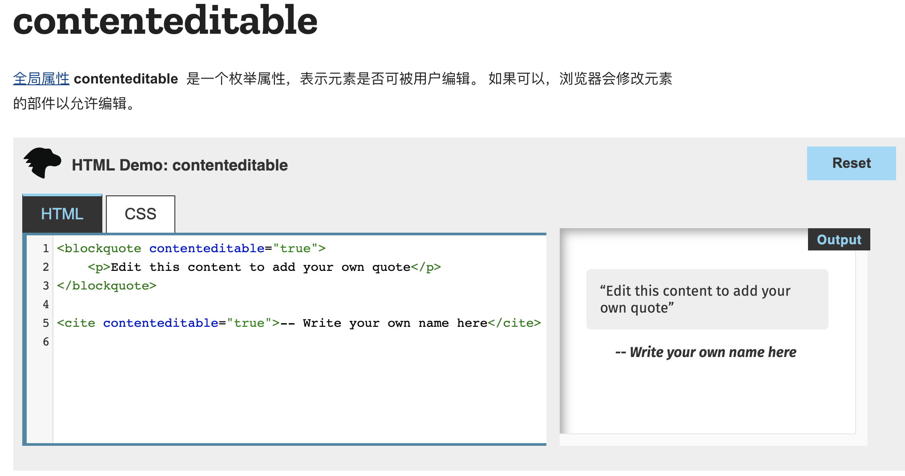
  - 自主实现一套完整的排版引擎，虽然最底层依旧使用的 DOM，但在开发层面对浏览器的排版能力做了进一步的抽象加强，完全不依赖浏览器的 Form 元素和 contentEditable 的编辑能力，包括光标，选区，触发事件都完全独立实现，比如 GoogleDocs
  - 甚至还有完全脱离 DOM，基于 Canvas 的文本编辑器，但是目前还没有看到过基于 Canvas 的开源编辑器存在，基本还属于玩具范畴
- 下图是开源 Canvas 编辑器[`primrosevr`](https://www.primrosevr.com/)
  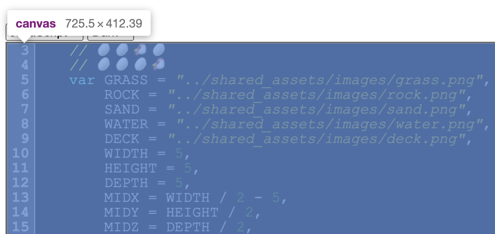

### Controller

- Controller 用于捕获 EditorView 中触发的各种事件，然后执行 Command 去修改视图模型和 DOM
- 理想情况下，用户在编辑器 UI 上操作触发输入事件，Controller 捕获 EditorView 中触发的事件，然后去分发具体的 Command 修改视图模型，再使用 UI 工具如 React 把视图模型转换为真实的 DOM，使编辑器整个的数据处理有了一个完整的单向数据流，稳定，可控。
  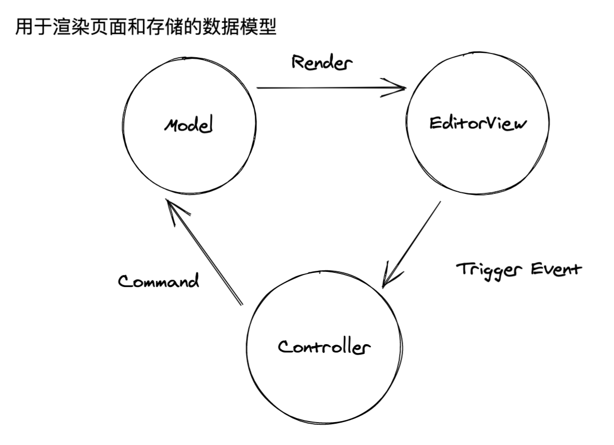

## 编辑器的技术迭代

更具编辑器技术的衍进，大致可以分为四代，也有划分为三代的说法，他们不一定完全正确，有的编辑器技术可能同时具备两代的特征

### 第一代

- 几乎完全基于浏览器原生技术实现，使用 contentEditable 作为编辑区域，同时使用 html 作为视图模型，文本输入基本上是浏览器的默认行为，通过执行原生的 `execCommand` 去操作 DOM 实现富文内容的新增修改，例如插入无序列表，Heading，开源项目如 wangeditor
  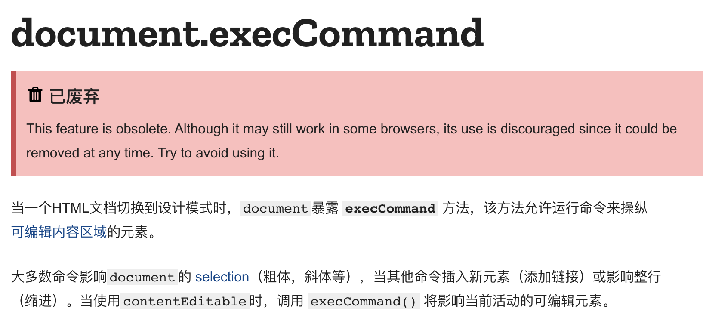
  ```js
  document.execCommand("selectAll")
  document.execCommand("copy")
  ```
  - 缺点
  - 由于完全依赖原生 execCommand 去操作 DOM，由于不同浏览器可能有不同的实现，实际的修改结果与浏览器有关，导致相同的数据在不同浏览器上表现不一致
  - 因为没有阻止浏览器默认行为，而是通过 DOM 去倒推 Model，所以很容易因为不可预测的交互，出现数据混乱的情况
- 优点
  - 优点也是有的，底层完全使用浏览器原生能力，天生就不存在令人头疼的 IME 输入问题
  - 渲染方便，直接使用 HTML 文件作为存储模型，不需要任何 UI 框架

### 第二代

- 在第一代的基础上解决 execCommand 在各浏览器上实现不一致，功能有限的问题，放弃使用原生 execCommand，「自行划归指令集范围」，开源项目如早期的 CKEditor
  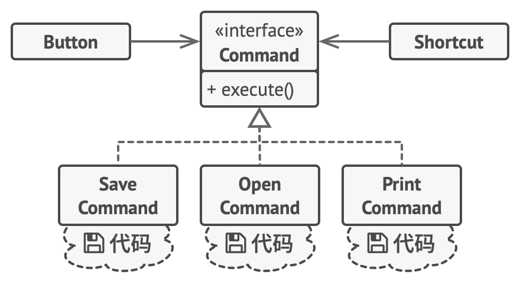
- 优点
  - 自主实现的 execCommand 极大提升了功能的灵活性和可用性
- 缺点
  - 仍旧使用 HTML 作为视图模型和存储模型，导致数据的比较非常困难，容易影响协同和增量同步等功能的实现，商业产品印象笔记底层就是使用的 HTML 做数据存储

### 第三代

- 这一代继续在上代的基础上继续完善，将主流的前端的架构理念应用到了编辑器的开发中，比如彻底使用 JSON 数据格式代替 HTML 描述富文本内容的视图模型，引入不可变数据，解决之前数据比较困难和数据流混乱的问题
- 并且第三代编辑器开始使用拦截事件默认行为的方式，阻止编辑器越过 DOM 先行更新视图的行为，而是先执行自定义 Command 修改视图模型，再通过实现单向数据流约束视图的更新，避免出现 Model 混乱的情况， 但是这一实现，依赖 contentEditable 的 [beforeInput]([https://developer.mozilla.org/zh-CN/docs/Web/API/HTMLElement/beforeinput%5C_event]) 这个实验性特性，现阶段并不可靠
  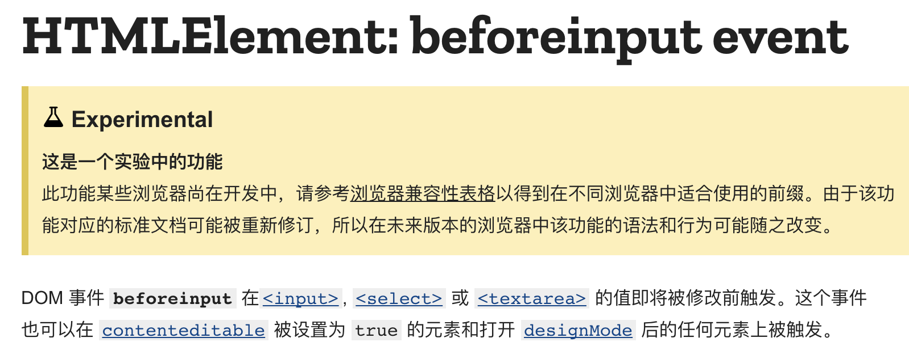
- 目前主流的开源编辑器都处于这个阶段，如 Slate.js，Drafts.js，正如上面所说，beforeInput 由于属于实验性特性，它在不同浏览器下有完全不同的表现，即使仅在 Chrome 下也有很多问题，尤其是在 IME 输入上
- 举个 🌰
  - 在通过 IME 全选输入时，onBeforeInput 无法阻止 IME 破坏 contentEditable 内部现存的 DOM 结构，当 onBeforeInput 触发时 DOM 结构已经发生变更，导致此时 React 中 Fibe 和 DOM 不一致，当再次执行 react 更新周期时，react 发现需要卸载的 Fiber 所对应的 DOM 已经不存在了，从而报错，这打乱了数据流，使视图模型和 DOM 出现了不一致
    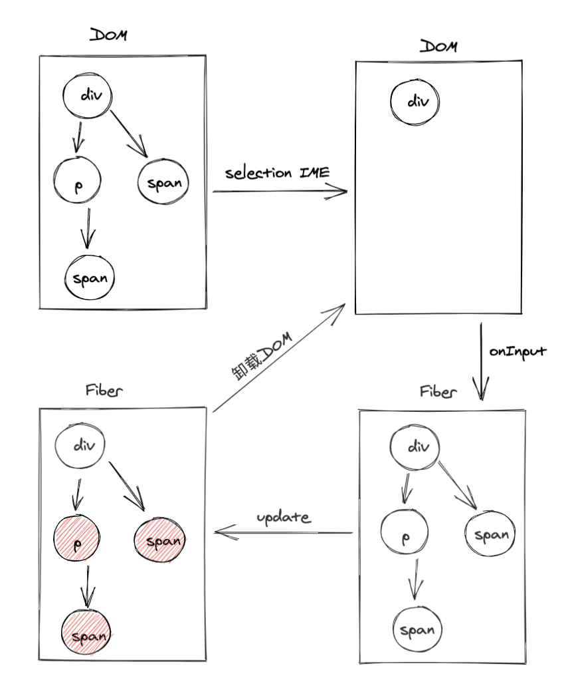
  - 在 Safari 下有完全不同的表现，IME 不再能够输入任何数据，但是仍旧会清空选区导致另一个异常
- 如何解决这个问题？处于这个阶段的编辑器大致一下两种种解决方式
  1. 依旧使用单向数据链，但是通过 [`compositionstart`](https://developer.mozilla.org/zh-CN/docs/Web/API/Element/compositionstart_event) 事件做 Hack 解决问题， `compositionstart` 事件只在使用 IME 输入时触发，选词结束时触发 `compositionend`，所以可以在触发 `compositionstart` 时，保留选区的 DOM，当 `compositionend` 触发时回滚选区的 DOM，使 React 下次更新时，DOM 和 Fiber 保持一致
     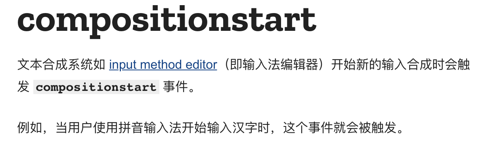
  2. 放弃使用单向数据流， 通过 MutationObserver 观察编辑器的 DOM 变化，一旦出现变动，同步 DOM 的更改到视图模型中，也就是说存在双向数据流，好处是可以一劳永逸的解决 IME 的所有问题，坏处是需要非常小心的处理数据的双向同步以及视图更新的时机，如果出现问题很难定位，开源项目如 Editor.js
- 总结
  - 第三代最大的特点是在底层设计上考虑了协作（业务上需要自行实现 [operation transform](https://www.wikiwand.com/en/Operational_transformation)冲突合并算法）和插件化设计，这些特性使这些开源项目可以用于商业产品，如使用 Quil.js 的石墨文档，使用 Slate.js 的 Remnote，使用 ProseMirror 的 confluence
  - 缺点是 contentEditable 的缺陷影响了产品迭代的稳定性

### 第四代

- 走到这一版，看似只剩编辑体验是最后的问题了，为了解决这个问题，第四代编辑器出现了
- 他们㕛㕛一次进一步减少了对浏览器原生能力的依赖，既然 contentEditable 作为编辑区域他的行为不可控，就干脆抛弃 contentEditable，自主实现编辑能力，甚至是内容排版引擎，从而摆脱浏览器对编辑器实现的影响
- 为了实现可控的编辑区域，编辑器的发展有了大致两个分支
  1. Google Docs，腾讯文档：完整实现一套排版编辑系统，从元素排版到光标选区，输入事件等等，没有使用任何 HTML Form 元素或者是 contentEditable 特性，实现成本和难度都是十分巨大的，尤其是腾讯文档，甚至抛弃了 DOM，直接使用 Canvas 作为排版文档的技术，主要是为了解决高级排版的问题
  2. 有道云笔记这类，依旧使用 DOM 的排版能力，但是自绘了选区和光标，通过 Hack 的方式实现原生输入事件，成本相对于 Google Docs 是一个折中方案，效果足够好，表现也十分稳定，实现难度和成本也属于可接受的范围
- 但是无论是哪个方案，都要解决两个主要问题
  1.  由于没有可编辑区域，需要自主实现选区和光标
      通过记录 mousedown，mouseup 事件，获取鼠标选区位置，再使用 div 遮罩做绝对定位，模拟浏览器自带的 selection 效果，如果 mousedown 和 mouseup 在同一位置，则插入闪缩的光标代替遮罩
      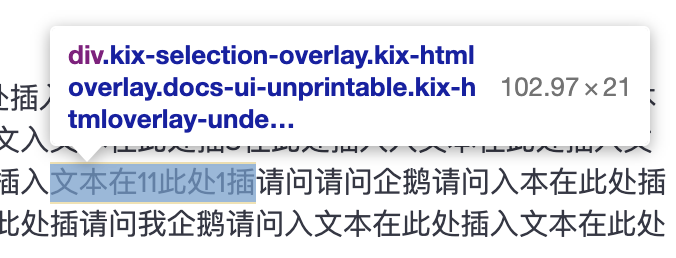
  2.  由于没有可编辑区域，需要自主实现输入事件
      目前已知没有任何 api 可以调用 IME 输入，也就是说如果不使用 input，contentEditable 这些原生可编辑元素，就没有办法进行中文输入，这也是开源 cancas 编辑器 https://www.primrosevr.com/ 无法中文输入的原因
      所以包括 GoogleDocs 在内的第四代编辑器都使用了一种讨巧的方法，在光标后面藏一个隐藏的 input 和 contentEditable 元素，它不需要展示排版，仅用来触发用户的 IME 输入事件
      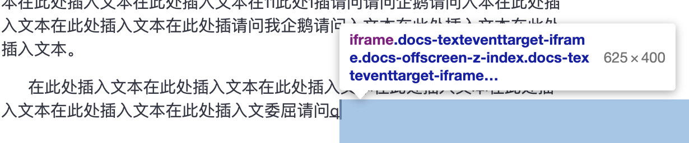

## 总结

- 从编辑器的技术发展可以看到为了摆脱浏览器的限制，编辑器不断抽离浏览器的原生能力去自主实现技术细节，也许有一天随着浏览器规范的不断完善，实现一个编辑器不再需要变得这么麻烦
- 同时，我在学习编辑器技术的过程中看到有很多有深度的技术概念，比如协作冲突合并算法，内容搜索算法，设计模式，插件化架构设计等等，从中以点带面收获了很多新知识，我会在今后通过文章总结的方式分享给大家共同成长
